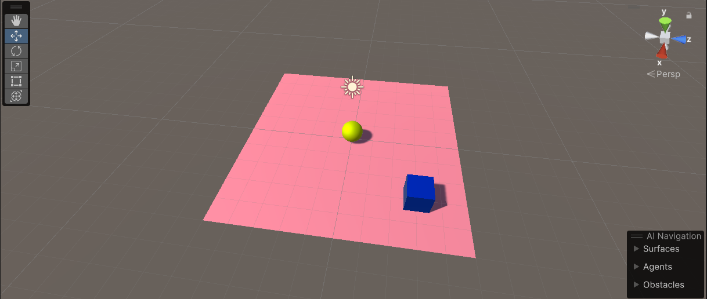

<h1 align="center"><i>GAME WITH ARTIFICIAL INTELLIGENT ADDITIONS</i></h1>

In this project, we again used the training we received to delete the examples in the mlagents library and recreated them from scratch. We created YAML files and wrote script files. In the first two scenes, our agent learns to avoid hitting spheres. In another scene, our agent tries not to drop the ball on its head, and in the last scene, our agent tries to drag the block into the green area. When the dragging occurs, it earns a reward.

   

      
      
      
      
      
      
      
      
      
      
      
      
      
      
   

